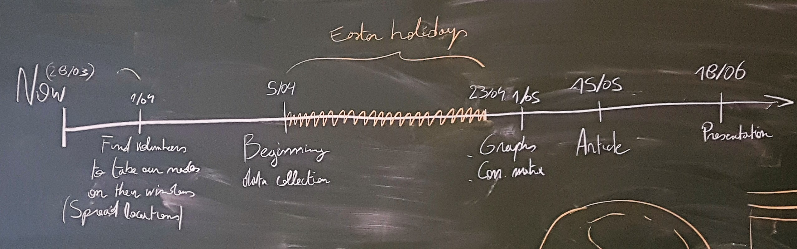
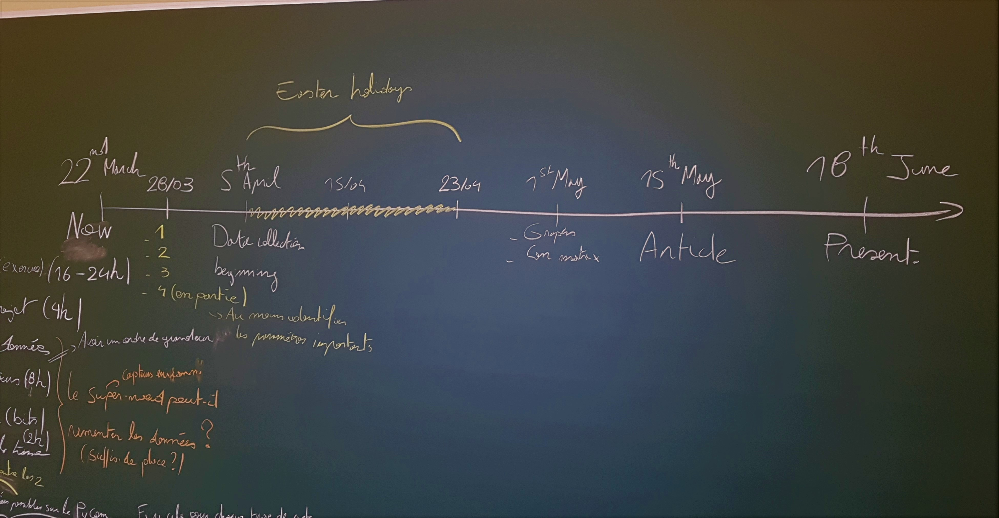
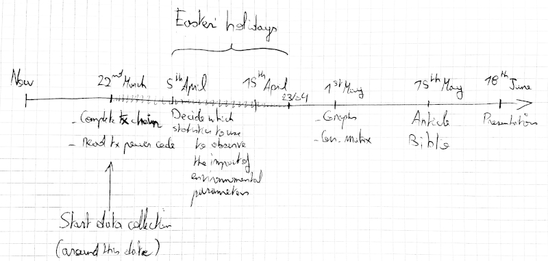
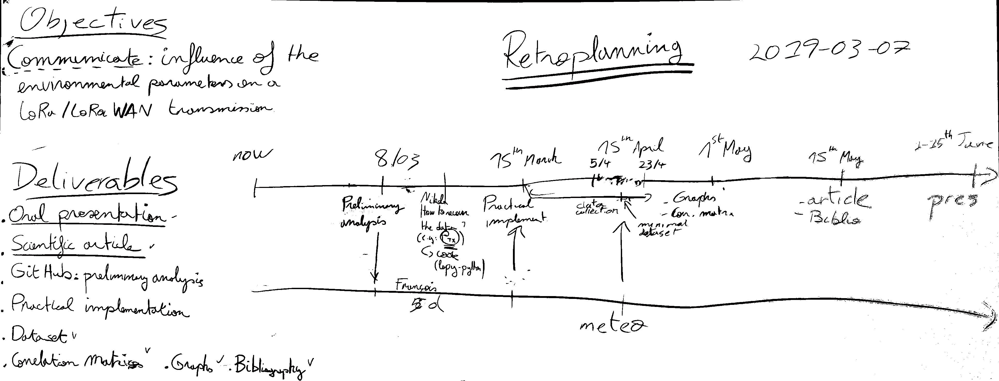

# Meeting notes

## 2019-03-28

### Attendees

* Francois
* Véronique
* Nikola

### Notes

* Retroplanning 
* Review of the document about maximum payload size and values returned by sensors for environmental parameters
* Discussion about needed GPS values and need accuracy
* Discussion about the different kinds of nodes
* Suggestions for the super-node (use Pytrack or Pysense)
* Advices for analysing the data (methods and graphs)
* Discussion about the placement of the nodes in Mons

### Next steps

* [ ] Find volounteers to take our emitters and put them on their window sill or balcony
* [ ] Write a small tutorial to explain to volounteers how to place the nodes and how to recover the GPS coordinates
* [ ] Make a list of the participating volounteers and the nodes they received
* [ ] Find solutions for the super-node (identify where to connect the sensors, how, is there I2C available, ...)
* [x] Adopt a more pragmatic approach for the GPS values to return (see scripts for comments)

## 2019-03-22

### Attendees

* Francois
* Véronique
* Nikola

### Notes

* Retroplanning 
* Adjusted the retroplanning
* Discussion about the document with the complete transmission chain
* Suggestions for improvements (for the document)
* Explaining how to Adjust the transmission chain to our project
* Questions/answers about the statistics to use first

### Next steps

* [x] Find out what kind of data the sensors will give (super-node) and the size of this data
* [x] Find out the size of the payload (min and max values) in the LoRaWAN data frame
* [x] Adjust the transmission chain to our project (by considering the remarks)
* [x] Identify the minimum required GPS parameters to fit in the payload field
* [x] Write a python code that will get these GPS parameters

## 2019-03-18 (Skype)

### Attendees

* Francois
* Véronique
* Nikola

### Notes

* Retroplanning 
* Adjusted the retroplanning
* Statistics and graph to use with the .csv files
* Complete transmission chain to provide for the next meeting
* How to deploy the end-devices, what is needed right now
* Planning the next meeting (22/03)

### Next steps

* [X] give the complete transmission chain (from the data to the .csv file)
* [ ] implement fetching the tx_power, storing it in the non-volatile memory and sending a payload with the last 3 values

## 2019-03-07

### Attendees

* François
* Nikola

### Notes
* Retroplanning 
* Brainstorming
* Completion of the data structure files and parameters to measure

### Next steps

## 2019-03-06

### Attendees

* François
* Nikola
* Véronique

### Notes

### Next steps

* [X] 08/03 report what needs to be collected:
  * internal parameters
  * external parameters with priority
* [X] write dummy CSV files with selected data

## 2019-02-27

### Attendees

* François
* Nikola

### Notes

* setup the gateway
* upload firmware to lopy
* check data received in TTN console
* check data received on tsvisu Node-RED
* discuss about data storage structure

### Next steps

* [X] reproduce LoPy to tsvisu setup at home
* [X] provide a draft data storage structure
* [X] provide a list of outputs (graphs, statistics, ...)
* [X] provide a list of factors to measure
* [X] complete this journal with previous meeting notes

## 2019-02-21

### Attendees

* François
* Nikola
* Véronique

### Notes

* Discussion about the parameters to measure and that would impact the LoRa communication (environmental and other kind)
* Presentation of the weather monitor from IRM
* Further explanation about the way to analyze the performance of the LoRa transmission
* Discussing about how to find the relevant parameters during the test procedure
* Presentation of "The Things Network" interface and console
* Quick presentation of the TTN gateway and how to see the data that passes through one of these

## 2019-02-14

### Attendees

* François
* Nikola
* Véronique

### Notes

* OSI model of a LoRa/LoRaWAN transmission
* Definition and explanation of the features of LoRa technology : https://github.com/TheThingsNetwork/lorawan-stack (Features - LoRaWAN Network Server and LoRaWAN Application Server)
* Discussion about the LoRaWAN frame
* Explanation about the MQTT protocol
* Presenting the "connection chain" that we will use for the project to analyze performance variability

## 2019-02-06

### Attendees

* François
* Nikola
* Véronique

### Notes

* Discussion about the different elements in a LoRa connection (gateway, router, broker and app. server)
* Explanation of a basic communication between an end-device and and application server
* Explanation of the "link budget"
* Presentation of Grafana (how to display the data received on a gateway from an end-device)

## 2019-02-04

### Attendees

* François
* Nikola
* Véronique

### Notes

* Presentation of the project
* General specifications about LoRa/LoRaWAN (modulation, spreading factor, range, RSSI, ...)
* Quick comparison with other wireless technologies
* Establishement of the goals of the project and the documents to deliver at the end
